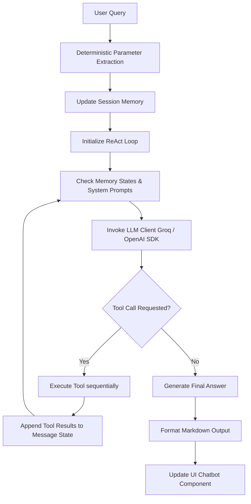
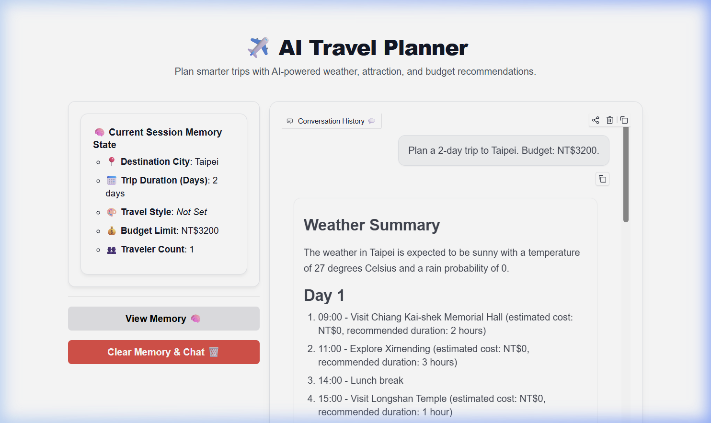

# AI Travel Planner ✈️

A professional-grade, weather-aware, and budget-aware AI Travel Planner built with Python, Gradio, and Groq API. The planner leverages an LLM-based agent operating inside an iterative ReAct execution loop to collect, filter, and plan day-by-day travel itineraries.

---

## 🏗️ Architecture

The AI Travel Planner operates under an iterative **ReAct (Reasoning and Action)** agent loop. Instead of generating a single-shot itinerary, the agent continuously inspects its parameter states, triggers required tools sequentially, processes results, and updates its session memory before producing a final formatted plan.



### Key Architectural Layers:
1. **Extraction Layer**: Prior to sending data to the LLM, inputs are parsed deterministically via regular expressions to extract targets (City, Days, Budget, Travelers, Style).
2. **Session Memory**: Acts as a stateful metadata ledger tracking travel parameters across dialogue turns.
3. **True Iterative Loop**: The agent loop runs dynamically up to 10 iterations per turn, allowing multi-step reasoning (e.g. `update_session_memory` ➔ `get_weather` ➔ `get_google_places` ➔ `final_itinerary`).
4. **Logging Layer**: Centralized Python logging controlled by `DEBUG` setting inside `config.py`.

---

## 🌟 Features

- **Stateful Conversation Memory**: Stores user constraints (duration, lodging, budgets, style) across multiple chat rounds.
- **Dynamic Weather Integration**: Fetches real-time weather forecasts via **Open-Meteo API** to deterministically filter out outdoor activities if the rain probability is $\ge 50\%$.
- **Budget-Aware Attraction Filtering**: Computes minimum baseline travel expenses (food, local transit, lodging) and automatically filters out attractions that exceed the remaining allowance.
- **Multi-Source Attractions Lookup**: Utilizes **Google Places API** to retrieve details (ratings, review counts, types) of top attractions, falling back to a curated local database if API key or network fails.
- **Premium ChatGPT-Style Interface**: Crafted using Gradio 6.x, featuring a 20% left sidebar for memory state cards and an 80% right panel for conversation dialogue bubble elements.

---

## 📂 Folder Structure

```
travel-agent-practice/
│
├── config.py             # Consolidated application and logger configurations
├── requirements.txt      # Project library dependency packages
├── README.md             # Developer handbook and setup guides
├── .env                  # API keys and secret variables (ignored by git)
│
├── agents/
│   └── travel_agent.py   # State coordination, ReAct agent loop, and logic prompt
│
├── memory/
│   ├── session_memory.py # Metadata parameters ledger
│   └── extractor.py      # Regex rules for deterministic inputs extraction
│
├── tools/
│   ├── attraction_tool.py# Local database attraction structures and backups
│   ├── weather_tool.py   # Open-Meteo API wrapper
│   └── google_places_tool.py # Google Places API text search integration
│
├── ui/
│   ├── __init__.py       # Package exposure mappings for backward compatibility
│   ├── ui.py             # Gradio Blocks layout interface definitions
│   └── styles.css        # ChatGPT-style theme and shadow stylesheet rules
│
├── docs/
│   └── screenshots/
│       └── ui_layout.png # Interface render preview
│
└── tests/
    └── debug_suite.py    # Diagnostic test verification suite
```

---

## ⚙️ Installation

1. **Clone the Repository**:
   ```bash
   git clone https://github.com/your-username/travel-agent-practice.git
   cd travel-agent-practice
   ```

2. **Create a Virtual Environment**:
   ```bash
   python -m venv .venv
   # On Windows (PowerShell):
   .venv\Scripts\Activate.ps1
   # On macOS/Linux:
   source .venv/bin/activate
   ```

3. **Install Dependencies**:
   ```bash
   pip install -r requirements.txt
   ```

4. **Environment Variables**:
   Create a `.env` file at the root of the project:
   ```env
   GROQ_API_KEY=your_groq_api_key_here
   GOOGLE_PLACES_API_KEY=your_google_places_api_key_here # Optional (falls back to local DB if empty)
   ```

---

## 🚀 Running the Project

1. **Start the Gradio Application**:
   ```bash
   python ui/ui.py
   ```
   Open the printed URL (typically `http://127.0.0.1:7860`) in your web browser.

2. **Run the Diagnostic Test Suite**:
   To verify that all components, API integrations, memories, and callbacks match the expected schemas:
   ```bash
   python tests/debug_suite.py
   ```

---

## 📸 Screenshots



---

## 🛠️ Future Improvements

- **Interactive Maps Integration**: Display routes and attraction locations dynamically using Leaflet/Mapbox inside the Gradio interface.
- **Flight & Hotel Booking Mocks**: Add flight booking and hotel search tools to compute and optimize complete travel packages.
- **State Exporting**: Allow users to download their generated travel itineraries as PDF or export them directly to Google Calendar.

---

## 🧰 Technologies

- **Python 3.11**
- **Gradio 6.x**
- **Groq API** (Llama-3.3-70b-versatile)
- **OpenAI SDK** (OpenAI-compatible endpoints)
- **Open-Meteo API** (Weather forecasts)
- **Google Places API** (Attraction data searches)

---

## 📄 License

This project is licensed under the MIT License - see the LICENSE file for details.
